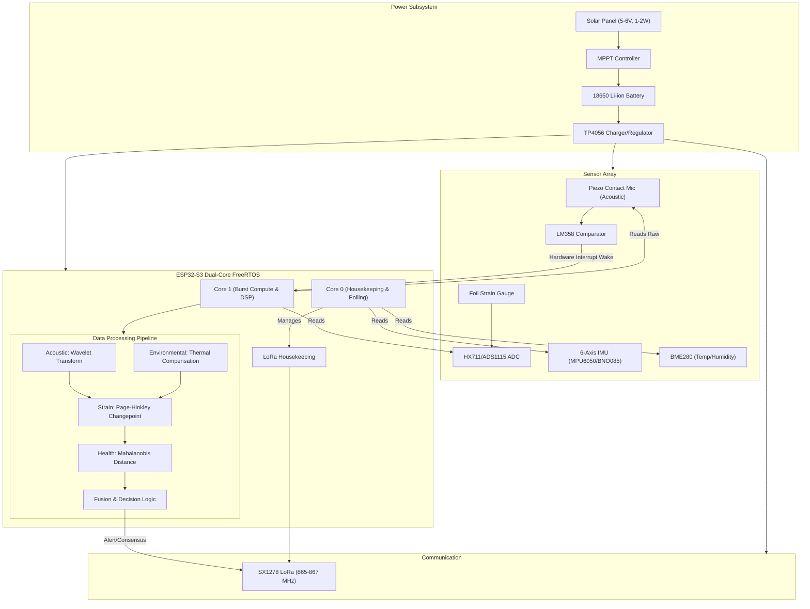
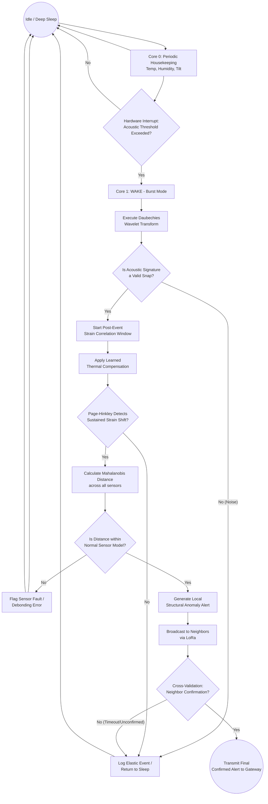

# 02. System Architecture

## 1. Architecture Overview

This document serves as the master architecture reference and single source of truth for the system design of the ATF V-2.1 Edge-Processed Structural Health Monitoring (SHM) Node. The ATF V-2.1 node is a self-contained, solar-powered, edge-computing device specifically designed for continuous, long-term monitoring of structural integrity, primarily focusing on concrete highway bridges.

The architecture is built around an event-triggered, dual-core processing paradigm using an ESP32-S3 microcontroller. It integrates multiple sensor modalities (acoustic, strain, tilt, and environmental) to detect, validate, and communicate structural anomalies while minimizing power consumption and false alarms. The system employs advanced signal processing and TinyML techniques directly at the edge, reducing the reliance on cloud infrastructure and ensuring rapid, localized decision-making.

This document details the hardware components, the multi-stage processing pipeline, the core subsystems, and the future phase enhancements.

## 2. System Block Diagram

The following diagram illustrates the hardware components, the dual-core architecture of the ESP32-S3, and the high-level data flow through the processing pipeline.

## 3. Core Subsystems (Detailed)

The prototype scope of the ATF V-2.1 consists of six core subsystems working in concert to detect and validate structural anomalies. For deeper technical analysis of these subsystems, see the [Subsystem Deep Dive](./03_Subsystem_Deep_Dive.md).

### 3.1. Acoustic Emission (Micro-Fracture Detection)
* **Purpose:** To detect high-frequency transient stress waves indicative of micro-fractures, concrete cracking, or wire snapping.
* **Hardware:** High-frequency piezoelectric contact microphone paired with an LM358 comparator circuit.
* **Method:** Operates as the primary wake-up trigger. The comparator monitors the raw analog signal; upon crossing a predefined threshold, it generates a hardware interrupt waking Core 1. Core 1 then samples the raw acoustic burst and applies a Daubechies wavelet transform.
* **Mathematical Basis:** Wavelet transforms provide both time and frequency resolution, crucial for non-periodic, short-duration transients like snaps, which FFT cannot adequately resolve. The energy extracted from fast decomposition levels characterizes the event.
* **Inputs/Outputs:** Input is raw acoustic voltage; Output is a high-confidence snap classification and a precise timestamp.
* **Pipeline Connection:** The precise timestamp triggers the "Strain Correlation Window" in the next subsystem.

### 3.2. Strain and Deformation (Physical Bending)
* **Purpose:** To measure physical bending and structural deformation, establishing causal correlation with acoustic events.
* **Hardware:** Foil strain gauge in a Wheatstone bridge configuration, amplified by an HX711 or ADS1115 load-cell ADC.
* **Method:** Upon receiving a snap trigger from the Acoustic subsystem, Core 1 analyzes the strain time-series data within a post-event window. It uses Page-Hinkley changepoint detection on the thermally-compensated strain data to identify genuine sustained baseline shifts versus transient noise.
* **Mathematical Basis:** Page-Hinkley is a sequential analysis technique designed for abrupt change detection in the mean of a signal. It accumulates statistical evidence of a shift, filtering out temporary elastic deformations.
* **Inputs/Outputs:** Inputs are raw strain data and the acoustic event timestamp. Output is a boolean confirmation of a causally correlated fracture candidate.
* **Pipeline Connection:** If a sustained shift is detected post-snap, it represents a high-confidence structural fault. If not, the system flags it as an elastic event or routes to the IMU for a foundation check.

### 3.3. Spatial Tilt and Settling (Inclinometer)
* **Purpose:** To provide a long-term sanity check for macroscopic foundation settling, pier tilt, or structural drift.
* **Hardware:** 6-axis MEMS IMU (MPU6050 or BNO085).
* **Method:** Core 0 periodically polls the IMU during its housekeeping cycle. It tracks long-term drift rates and cross-checks them against the historical noise floor.
* **Mathematical Basis:** Statistical tracking of moving averages and variance to detect slow-moving trends outside known safe envelopes.
* **Inputs/Outputs:** Input is 6-axis motion/tilt data. Output is long-term structural drift metrics.
* **Pipeline Connection:** Operates somewhat independently but informs the Fault Discriminator if the drift is anomalous, suggesting sensor debonding or catastrophic foundation issues.

### 3.4. Environmental Compensation
* **Purpose:** To isolate true mechanical strain from apparent strain caused by thermal expansion and contraction.
* **Hardware:** BME280 (Temperature and Humidity sensor).
* **Method:** The system undergoes a 14-day autonomous calibration phase upon installation, logging paired samples of temperature and raw strain during normal diurnal cycles. It learns a structure-specific thermal-expansion coefficient.
* **Mathematical Basis:** Linear or polynomial regression fitting the relationship between temperature variations and raw strain readings.
* **Inputs/Outputs:** Inputs are ambient temperature and raw strain. Output is a dynamic compensation offset.
* **Pipeline Connection:** The calculated thermal offset is subtracted from the raw strain data *before* it is fed into the Strain & Deformation changepoint analysis.

### 3.5. Sensor-Fault vs. Structural-Fault Discrimination
* **Purpose:** To differentiate between genuine structural anomalies and sensor degradation, debonding, or hardware failure.
* **Hardware:** Integrates data from all onboard sensors.
* **Method:** Treats the current state of all sensors (acoustic energy, strain level, tilt) as a single point in a multidimensional space. It compares this point against a continuously updated model of "normal joint sensor behavior".
* **Mathematical Basis:** Mahalanobis Distance. This metric measures the distance of a point from a distribution, accounting for correlations between variables. If the distance exceeds a threshold, it indicates that inter-channel correlations have broken down (e.g., strain reading jumps wildly without an accompanying acoustic event or temperature change).
* **Inputs/Outputs:** Inputs are processed outputs from all subsystems. Output is a health flag indicating sensor integrity.
* **Pipeline Connection:** Acts as a final gatekeeper before triggering alerts, ensuring that hardware faults are not reported as structural failures. For more details on the TinyML implementation of this, see [TinyML Integration](./04_TinyML_Integration.md).

### 3.6. Multi-Node Cross-Validation
* **Purpose:** To provide distributed consensus and reduce false alarms in a deployed network of nodes without relying on cloud processing.
* **Hardware:** SX1278 LoRa transceiver.
* **Method:** When a node detects a local anomaly, it broadcasts an alert over the LoRa mesh network. Neighboring nodes listen for this broadcast and check their local data for correlated anomalies within a specific time and confidence window.
* **Mathematical Basis:** Time-synchronized distributed consensus algorithms.
* **Inputs/Outputs:** Inputs are local anomaly alerts and received alerts from neighbors. Output is a validated, network-level consensus alert.
* **Pipeline Connection:** This is the final stage before a definitive "Structural Fault" message is transmitted to the gateway. See [Data Flow Pipeline](./06_Data_Flow_Pipeline.md) for network-level flow.

## 4. Phase 2 / Stretch Enhancements (FUTURE)

The following subsystems are planned for future development and are **not included in the V-2.1 prototype scope**.

### 4.1. Physics-Informed Residual Modeling ("Digital Twin")
* **Concept:** Implementing a lightweight beam-deflection model directly on the node. The model predicts the expected strain for a given environmental load.
* **Method:** An anomaly is defined as a significant residual (difference) between the model's predicted strain and the physically observed strain, effectively serving as an edge-computed digital twin.

### 4.2. Dempster-Shafer Evidence Fusion
* **Concept:** Upgrading the final decision logic from simple boolean or threshold-based fusion to a formal evidence-combination framework.
* **Method:** Using Dempster-Shafer theory to merge belief from each subsystem, allowing for explicit representation of uncertainty, conflicting evidence, and ignorance.

## 5. Design Principles

The ATF V-2.1 architecture is guided by the following core principles:

1.  **Event-Triggered Architecture:** To maximize battery life, the system remains in deep sleep or low-power polling mode (Core 0) for the vast majority of its operational life. High-power DSP and ML tasks (Core 1) are executed only in burst mode, triggered by specific hardware interrupts (e.g., an acoustic snap).
2.  **Edge-First Processing:** All critical signal processing, anomaly detection, and classification occur on the node. Raw data is not streamed to the cloud, drastically reducing communication bandwidth and power requirements.
3.  **Self-Calibration:** Structures behave uniquely. The node employs autonomous calibration phases (like the 14-day thermal learning) to establish baseline behavior specific to its deployment location, rather than relying on generalized factory thresholds.
4.  **Sensor Self-Diagnosis:** The system actively models its own health to distinguish between structural degradation and internal hardware faults (sensor debonding, wiring issues), minimizing false dispatch of maintenance crews.

## 6. Target Application

The primary target application for the ATF V-2.1 node is the monitoring of **concrete highway bridges**. The sensor suite and algorithms are optimized for detecting the specific failure modes of concrete (micro-cracking, rebar yielding, spalling) and the heavy, dynamic loads of highway traffic.

While the architecture is modular and theoretically adaptable to other structures (pipelines, steel trusses), these applications represent future stretch goals and would require retraining the TinyML models and potentially adjusting sensor parameters.

## 7. Pipeline Flow Diagram

The following flowchart illustrates the complete event-processing pipeline, from the idle state through to the final alert transmission.

